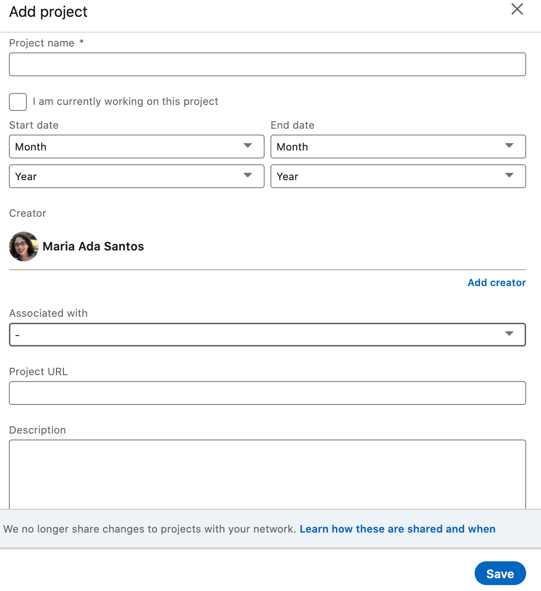

# Selecting what to include in the projects section

One of the Additional sections that you can add to your Linkedin profile is the **Projects section**.

### **What should you include in the Projects section?**

The Projects section is exactly what it sounds like: a section where you can showcase projects meant to display your dev skills. The Projects section is an expanded version of the Featured section: while your Featured section should focus on a few projects you feel are especially strong, your Projects section can showcase **any project you're proud of or that fully displays your development skills**.

Pick **at least 3-4 projects** that you think are particularly strong. **Do not choose HTML clones**; by now, you've created much more complex projects. You can choose projects you already listed in the Featured section, but **we strongly encourage** **you to choose 1-2 additional projects as well**. Remember, the purpose of a LinkedIn is to attract recruiters and hiring managers; you'll attract them better if you show off a range of projects.

**For each project, make sure you complete at least these three fields:**

1. **Project Name.**
2. **Project URL** (link to the GitHub repo. If no repo exists, link to the live demo)
3. **Description**. **Copy/paste** this description from GitHub.

We encourage you to also fill in other fields, like dates and additional creators, but at a minimum you must include these three fields per project.

### **Should you include other blocks from the Additional section?**

Sure! LinkedIn offers several types of blocks that can be added to your profile, including sections for publications, honors & awards, and languages. **We encourage you to add any other sections that may be relevant to you,** but keep in mind that you are meant to showcase **the best** of your accomplishments; adding a company award is much more valuable than adding an award from high school.

Two more things to keep in mind:

- **Don't** add test scores **unless** 1) you are a recent college graduate **AND** your test scores are extremely high (at least in the 90th percentile). If you do add test scores, make sure to include the percentile in the Description box (for example, *Title: GRE Verbal, Score: 167, Description: Scored in the 98th percentile*).
- Within the next 1-2 weeks, you'll be writing a **development-focused Article** as part of the Microverse curriculum. Set a reminder for one month from now: once you've completed that article, come back and add it to the Publication section of Accomplishments.

------

_If you spot any bugs or issues in this activity, you can [open an issue with your proposed change](https://github.com/microverseinc/curriculum-transversal-skills/blob/main/git-github/articles/open_issue.md)._
