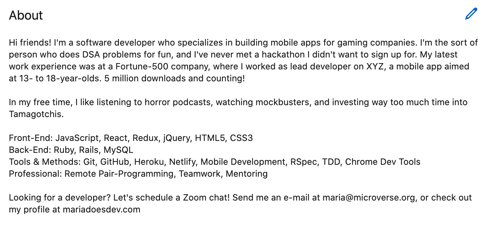

# What makes a compelling "About?"

As you know, an elevator pitch is a short, persuasive introduction to who you are and your major accomplishments—**[and you wrote one at the very beginning of your Microverse journey](https://github.com/microverseinc/curriculum-professional-skills/blob/main/interviewing/use-your-usp-to-craft-the-first-draft-of-your-elevator-pitch.md
)**. Its purpose to quickly show potential employers who you are and what you can do so that they're motivated to contact you.

On LinkedIn, you mention this information in the "About section". In addition to that, you should add other components: your **tech stack**
- a **call to action**.

```md
[Your elevator pitch] + [Your stack] + [A call to action] = LinkedIn's About section
```

Listing your preferred stack gives recruiters a quick idea of the technologies you've worked with, and the call to action will invite recruiters, hiring managers, and others to contact you.

For an example that follows this formula almost exactly, look below:



You should also add a little more information, such as:

- Testimonials from peers (which you can copy/paste from your LinkedIn recommendations)
- A few major projects you've worked on (which you can copy/paste from GitHub descriptions)
- 1-2 sentences about your hobbies or likes/dislikes
- A few accomplishments that didn't fit into your elevator pitch
- Some keywords that will help recruiters find you. Check [this link](https://github.com/microverseinc/curriculum-professional-skills/blob/main/interview-prep/preparing-your-linkedin-for-both-keyword-searches-and-hiring-managers-with-the-skills-section.md) for some suggestions.

Now take 10 minutes to update your **elevator pitch** and add any information that is missing, list out your **tech stack** and write a 1 sentence **general call to action**. Add that to the "About section".

- [Edit the About Section in your LinkedIn Profile](https://www.linkedin.com/help/linkedin/answer/a553140/edit-the-about-section-in-your-profile)

When you've done so, go through a second iteration and follow these guidelines to **format your text for a more appealing look**:
- If a sentence is longer than 3 lines, break it up and put a space in between
- Check for any typo's (with something like [Grammarly](https://www.grammarly.com/browser/chrome))
- Add useful links to work you've done

Try to aim for something like the example mentioned above!

------

_If you spot any bugs or issues in this activity, you can [open an issue with your proposed change](https://github.com/microverseinc/curriculum-transversal-skills/blob/main/git-github/articles/open_issue.md)._
